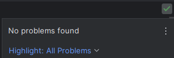

## My Own Standards

I was never really formally introduced to coding standards until my second semester when I took ICS 212, Program Structure. Yet, that concept was something that was instilled in me without even realizing it until I got more in depth into it. When I first began coding back in my junior year of high school, I always made sure that I used proper indentation to clearly delineate code nested inside of function headers or loops. Overtime, I began adding spaces in between the words and symbols of if statements and between elements inside of a collection. 

I did all of that because I wanted my code to look “pretty,” or at least presentable in a fashion that demonstrates I care about the looks of  my code. In the back of my mind though, I still knew for the most part that even if I didn’t necessarily make my code “pretty” by adding all of the spaces between things or sometimes not indenting things or putting things on a new line, it would still compile and run. 

## Standards That Fit For All

However, when I was finally introduced to the concept formally, at first I thought that it wouldn’t be too bad to follow as it, in a sense, “enforces” that code would look nice and presentable. That was until I learned that coding standards also enforce such trivial things such as the maximum number of characters that can be in one line, and also whether to put curly braces on the same line as a function header or if statement, or on a new line. All of which I lost partial points for as I got more in depth into my ICS 212 assignments. I was frustrated at first knowing that I had to conform to trivial standards that go beyond what I was used to with just making my code look organized, until silly me learned that there was a program that existed that could have checked for those coding style errors.

Coding standards aren’t there to make code “picture-perfect,” but from what I learned, it’s there to maintain consistency within the code. Programs aren’t just written, compiled, and run only on one’s local machine (which is something that high school me wasn’t used to), but they’re actually developed and deployed across many different environments. Not everyone will have hardware and software that is the exact same as one individual’s setup. Some won’t have IDEs available at their disposal and perhaps only the terminal to edit programs. Some won’t have large high resolution screens to view the longest lines of code. Coding standards mitigate the problems that arise from differences in hardware and software that every developer has. It ensures consistency so that code can be reviewed and fixed properly and efficiently regardless of the environment without any additional hassles.

## Supplmental Learning Through Active Checking


Many of the style issues that I had to work out were only learned about after running a separate linting program before compiling my program. But, with writing JavaScript for this Software Engineering course, ESLint was a tool introduced to ensure consistency in my code while working from my own local environment. ESLint would actively check for any programming or style errors while I was in my IDE writing my code. For the most part, getting that green checkmark in the top right corner was always a rewarding sight after finishing up my program, as I understood that ESLint is just an additional aide to ensure that the code I write is neat and organized, and efficient where all variables declared are used and functions that I created are called.

It’s not always the case where I get that green checkmark though, as I do tend to face difficulty with using some of the syntax that ES6 has introduced. However, the use of ESLint has aided me in following that ES6 syntax which helped me to get more comfortable with its usage while also simplifying my code both lengthwise and organization wise. For instance, utilizing function syntax from before versus with ES6:


```
function sum(nums) {
  return _.reduce(nums, function(memo, num) { return memo + num; }, 0);
}
```

Using ES6 syntax

```
function sum(nums) {
  return _.reduce(nums, (memo, num) => memo + num, 0);
}
```

With coding standards, not only will I improve the consistency in my written code, but it will also help me in the long run as many coding projects will involve working with others in various development and testing environments.