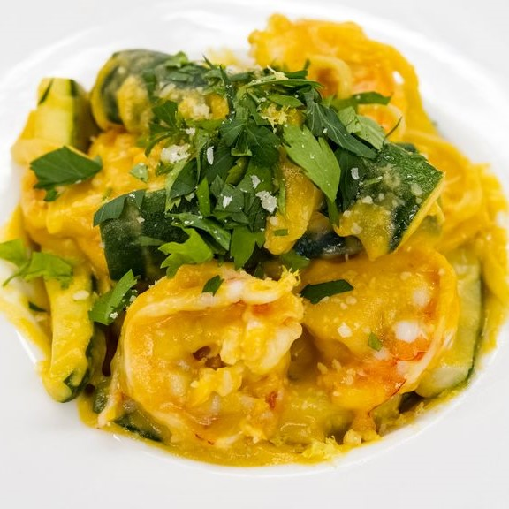

In the fall of 2021, a statewide culinary competition known as the Mahi'ai Culinary Competition, was held among all high schools in the state of Hawai'i. As part of the competition, a pair of students in a culinary program would work together to develop a new recipe that would be cooked in front of a panel of judges. This competition highlighted the use of local ingredients, therefore all recipes part of the competition must feature at least several local ingredients in the dish. Following the live cooking and tasting, all dishes submitted to the competition were featured on social media to be voted for by the public. Winners would be featured and the school's respective culinary programs would receive monetary prizes.

For my entry, I developed a recipe for my **Kauai Shrimp Pasta in a Roasted Pumpkin Puree Sauce**. Partnering up with a fellow student, Dylan Serrano, we worked together along with my instructor, Mr. Lars Mitsuda, on practicing the execution of this dish while making minor adjustments to flavor profiles and texture consistencies before the day of our presentation to the judges. As this competition took place during the Coronavirus pandemic, experimenting with this dish and practicing the making of it was a major challenge with the requirement of having to adhere to social distancing guidelines while minimizing contact with food items to serve to others to taste test. In the creation process, this recipe was inspired from a take on ravioli filled with a roasted pumpkin puree that we made to practice making ravioli. Combining my love for my mom's garlic shrimp, I combined the two flavor profiles along with an incorporation of various local vegetables to make a tasty, healthy, and filling pasta dish. After days of preparation and extra hours in the classroom's kitchen, the results of my team's hardwork paid off, as we won the third place spot in the state's competition. It was quite an experience to have the spotlight on me, my partner, and my instructor as thousands of people on social media and higher ups within the state's food and agriculture industry witnessed our creation among the other entries in the competition.

If you'd like to try the recipe out for yourself, you can view the recipe [here](https://alounfarms.com/blogs/recipes/kauai-shrimp-pasta-in-a-roasted-pumpkin-puree-sauce)! Please reach out to me if you have any questions about the preparation. :)

Source: [https://alounfarms.com/blogs/events/culinary-competition-2021](https://alounfarms.com/blogs/events/culinary-competition-2021)
