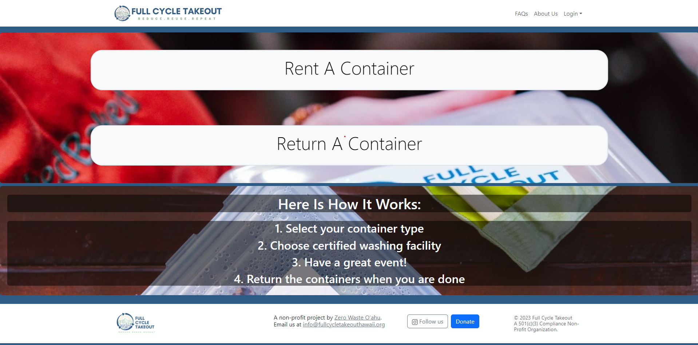

As part of our final project for ICS 314, our proposed solution addresses the challenge faced by the non-profit organization Full Cycle Takeout in managing the loss of reusable containers at events. We aim to design a mobile-compatible app with an intuitive user interface, allowing attendees to effortlessly 'check out' and return containers. Leveraging RFID technology for reliable user transactions, the app automates the rental process while maintaining accountability. The system includes a database to track container cycles and links user accounts to corresponding RFIDs, streamlining the return process. This solution caters to the diverse needs of events, offering flexibility for both large-scale and individual rentals. On the admin side, the app provides monitoring capabilities for container IDs and their status, ensuring effective management and sustainability for Full Cycle Takeout's reusable takeout container program.

In this team effort, my contributions mainly focused on the database aspect. Since this web app needed to keep track of items, in this case, the takeout containers, I worked on crafting the schemas needed to submit database entries and database queries. These schemas served as part of the backbone to our app's backend, allowing for users of the app to submit requests for checkouts and returns and keep track of the takeout containers in circulation.

To learn more about this project, the project webpage can be viewed on [GitHub](https://ethical-haccers.github.io/)