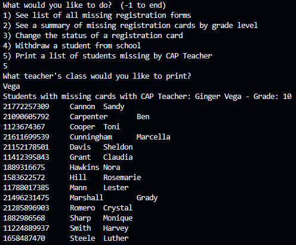

In high school, I've taken Advanced Placement (AP) Computer Science A, a class where I got right into object-oriented programming using Java. One project that I got to work on in this class was creating a program that would perform registration tasks similar to how the registrar's office handles students' registrations for the upcoming school year. Using everything that was taught to me about classes, loops, and file input and output, this project would put everything together to create something that would assist in the tasks that the school's registrar has to perform.

This program provided a simple interactive menu on the command line to allow the user to make selections for certain functions and store its output in files they can access. Behind the scenes, each student contains an ID number, first name, last name, grade, and Career and Academic Planning (CAP) teacher. The entire collection of students' registrations are stored in a dynamic array (Java ArrayList) and are sorted alphabetically by last name. The program supported the following operations on student registration information:
<ol>
    <li>See a list of all missing registration forms</li>
    <li>See a summary of missing registration cards by grade level</li>
    <li>Change the status of a student's registration card</li>
    <li>Withdraw a student from a school</li>
    <li>Print a list of students missing by CAP Teacher</li>
</ol>

In the course of doing this project, there were some things that I introduced to myself that I did not ever think about beyond just writing lines of code. I was taught a few sorting algorithms during my time in AP Computer Science A, but I wondered if there was more. Doing my research, I found that many more sorting algorithms existed, but all of them had something called `runtime complexity` attached to them. Wondering what the significance of it was, I briefly learned of the concept and took that into consideration when choosing what sorting algorithm I would use. To me, the sample list of students that I was working with looked relatively large to me, so I did want to choose a sorting algorithm who had a faster runtime than the insertion and selection sorting algorithms that I learned. Looking some up, I came across the quick sort algorithm, which introduced me to the whole concept of `divide and conquer` and gave me a good example of how recursion, another topic I briefly covered at the time, was used in more applicable cases. It was a big "wow" moment following my implementation of the quicksort algorithm, since I was implementing something I had never been taught before but it worked well in my program, as well as finishing up with two new concepts I had not learned in class before. I don't think I ever felt so excited to submit an assignment once!

Source Code on [GitHub](https://github.com/aris-carlos/Registration-Processing)